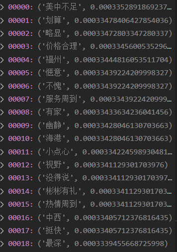

# 情感极性判断

## 引言

**情感极性分析**是对带有感情色彩的主观性文本进行分析、处理、归纳和推理的过程。本次实验中，我基于python语言、pytorch深度学习框架，采用**规则方法**、**统计方法**和**深度学习方法**实现了汉语句子的情感极性判断，最终的测试正确率分别为**68.7%**，**88.7%**和**91.2%**。代码已开源至GitHub个人主页，链接地址为：[HERE](https://github.com/Robin-WZQ/Text-sentiment-polarity-judgment)

## 实验一：基于规则的文本情感极性分析

### 1.1 基本原理

对语料进行情感打分，若score>0则为positive，反之为negative，其中涉及到情感词、否定词、程度副词、停用词四种词典。整体算法流程图如下图所示：

<div align=center>

</div>

### 1.2 数据准备

#### 1.2.1 BosonNLP情感词典

> 词典下载链接：https://kexue.fm/usr/uploads/2017/09/1922797046.zip。 据了解，此情感词典来源于社交媒体文本，适用于处理**社交媒体**的情感分析，对于其他种类样本进行分析效果不太好。

其用例展示如下：


词后面的数字表示为情感词的情感分数，正向为positive的词，负向为negative的词。

#### 1.2.2 《知网》情感分析用词语集(beta 版):

> 词典下载链接：https://download.csdn.net/download/liulangdeyuyu/5729931?utm_source=bbsseo

为了增加情感词典的泛化性，我还选取了来自《知网》统计的情感分析用词作为辅助情感词典。

#### 1.2.3 否定词词典

> 词典下载链接：https://kexue.fm/usr/uploads/2017/09/1922797046.zip

否定词可以直接将文本的内涵反转，而且还存在“否定之否定”这种叠加效果。常见的否定词如：不、没、无、非、难道 等等。

#### 1.2.4 程度副词

> 该词典来源于《知网》标注语料中的程度副词

基于规则的方法核心是对每个文本进行打分，那么分数的绝对值大小也会表示情感强烈程度。因此，对于程度副词的引入就显得尤为重要。我对每个程度副词程度值进行后处理，数据格式可参考图3。总共两列，第一列为程度副词，第二列为程度数值。规则如下：极其2，超1.8，很1.5，较1.1，稍0.7，欠0.5。这里暂定以上为初始值，后续实验将会探讨该定义对结果影响。


#### 1.2.5 停用词词典

> 词典参考：https://github.com/isnowfy/snownlp/blob/master/snownlp/normal/stopwords.txt

==观察到，停用词中存在很多否定词典和程度副词词典中出现的词，如：不 等，需要提前过滤掉，否则就会导致判断不准确的问题（下文的实验中将会讨论）使用如下方法进行过滤：==

```python
# ======================= 生成stopword表，需要去除一些否定词和程度词汇 =======================
stopwords = set()
fr = open('停用词.txt','r',encoding='utf-8')
for word in fr:
	stopwords.add(word.strip())
# ======================= 读取否定词文件 =======================
not_word_file = open('否定词.txt','r+',encoding='utf-8')
not_word_list = not_word_file.readlines()
not_word_list = [w.strip() for w in not_word_list]
# ======================= 读取程度副词文件 =======================
degree_file = open('程度副词.txt','r+',encoding='utf-8')
degree_list = degree_file.readlines()
degree_list = [item.split(',')[0] for item in degree_list]
# ======================= 生成新的停用词表 =======================		
with open('stopwords.txt','w',encoding='utf-8') as f:
	for word in stopwords:
		if(word not in not_word_list) and (word not in degree_list):
			f.write(word+'\n')
```

==同时，读取文本时候出现编码出错，据了解由于一个是gbk格式，一个是utf-8格式，最终通过errors='ignore'解决问题==

#### 1.2.6 语料库

> 这里选用酒店评价语料，下载链接为：https://download.csdn.net/download/coverspace/10432165
>
> 其中负例样本展示如下：“预订标准间：拐角房间（为什么携程订的都是拐角间），房间很小，隔音超差，房间非常冷，空调几乎不好用，卫生间更冷，几乎没法淋浴！三个字＂不满意＂！”

选择该语料原因如下：

1. 语料规模为10000篇，其中所用正类负类各3000篇；
2. 数据以进行标注，可以进行accuracy等结果计算；
3. 数据结构较好，易于读取和使用。

==值得一提的是，该数据集中的字符串包含很多无效的“\n”、“\n\n”等，需要处理掉==。代码如下：

```python
# 读入数据
for j in range(0,999):
    path = file_path+str(i)
    path = os.path.join(path,"neg")
    path = path+"/neg."+str(j)+".txt"
    with open(str(path), 'r',encoding='gbk', errors='ignore') as f:
    my_data = f.read() # txt中所有字符串读入data，得到的是一个list
    my_data = my_data.rstrip("\n")
    my_data = my_data.replace("\n\n",' ')
    neg_test.append(my_data)
```

### 1.3 数据预处理

#### 1.3.1 分词并删去停用词

- jieba库

```python
#jieba分词后去除停用词
def seg_word(sentence):
	seg_list = jieba.cut(sentence)
	seg_result = []
	for i in seg_list:
		seg_result.append(i)
	stopwords = set()
	with open('stopwords.txt','r',encoding='utf-8') as fr:
		for i in fr:
			stopwords.add(i.strip())
	return list(filter(lambda x :x not in stopwords,seg_result))	
```

- HanLP库

> HanLP是由何晗编写的自然语言处理的第三方库，其中针对中文分词进行特殊优化处理。这里首先需要安装JAVA环境，之后利用anaconda下载安装pyhanlp第三方库之后使用。

这里参考书籍《自然语言处理入门》中的分词工具，代码如下：

```python
#Hanlp分词后去除停用词
def seg_word(sentence):
	seg_list = HanLP.segment(sentence):
	for term in seg_list:
		seg_result.append(term.word) #抛弃分词结果中的词性
	stopwords = set()
	with open('stopwords.txt','r',encoding='utf-8') as fr:
		for i in fr:
			stopwords.add(i.strip())
	return list(filter(lambda x :x not in stopwords,seg_result))
```

### 1.4 情感分数计算

#### 1.4.1 词语定位

找出文本中出现的情感词、否定词和程度副词，并进行索引和标记：

```python
#找出文本中的情感词、否定词和程度副词
def classify_words(word_list):
	# 创建情感字典
	sen_file = open('BosonNLP_sentiment_score.txt','r+',encoding='utf-8')
	sen_list = sen_file.readlines()
	sen_dict = defaultdict()
	for i in sen_list:
		if len(i.split(' '))==2:
			sen_dict[i.split(' ')[0]] = i.split(' ')[1]
	#读取否定词文件
	not_word_file = open('否定词.txt','r+',encoding='utf-8')
	not_word_list = not_word_file.readlines()
	#读取程度副词文件
	degree_file = open('程度副词.txt','r+',encoding='utf-8')
	degree_list = degree_file.readlines()
	degree_dict = defaultdict()
	for i in degree_list:
		if len(i.split(' '))==2:        
			degree_dict[i.split(',')[0]] = i.split(',')[1]
            
	sen_word = dict()
	not_word = dict()
	degree_word = dict()
    
	#分类
	for i in range(len(word_list)):
		word = word_list[i]
		if word in sen_dict.keys() and word not in not_word_list and word not in degree_dict.keys():
			# 找出分词结果中在情感字典中的词
			sen_word[i] = sen_dict[word]
		elif word in not_word_list and word not in degree_dict.keys():
			# 分词结果中在否定词列表中的词
			not_word[i] = -1
		elif word in degree_dict.keys():
			# 分词结果中在程度副词中的词
			degree_word[i]  = degree_dict[word]
 
	#关闭打开的文件
	sen_file.close()
	not_word_file.close()
	degree_file.close()
	#返回分类结果
	return sen_word,not_word,degree_word
```

#### 1.4.2 分数计算

定义规则如下：
$$
score = (-1)^{times}*(\sum_{i=1}^n dgreenum* wordscore)
$$
这里，$$times$$为否定词在句中出现的次数，$$degreenum$$为程度副词的程度量（若存在则乘上其后情感词的情感分数），$$wordscore$$为每个词语的情感分数。

实现代码如下：

```python
def score_sentiment(sen_word,not_word,degree_word,seg_result):
    '''计算情感词的分数'''
	W = 1
	score = 0
	sentiment_index = -1
	sentiment_index_list = list(sen_word.keys())
		if i in sen_word.keys():
			score += W*float(sen_word[i])
			sentiment_index += 1
			if sentiment_index < len(sentiment_index_list)-1:
				#判断当前的情感词与下一个情感词之间是否有程度副词或否定词
				for j in range(sentiment_index_list[sentiment_index],sentiment_index_list[sentiment_index+1]):
					#更新权重，如果有否定词，权重取反
					if j in not_word.keys():
						W *= -1
					elif j in degree_word.keys():
						W *= float(degree_word[j])	
		if sentiment_index < len(sentiment_index_list)-1:
			i = sentiment_index_list[sentiment_index+1]
	return score
```

### 1.5 实验结果

#### 1.5.1 评价指标

为了评价分类器分类效果，我们采用正确率、准确率、错误率、召回率以及F-socre作为实验的评价指标。计算过程如下：

```python
TP,FN,FP,TN = loss(neg_test,pos_test)
acc = (TP+TN)/(len(neg_test)+len(pos_test))
error = (FN+FP)/(len(neg_test)+len(pos_test))
precision = TP/(TP+FP)
recall = TP/(TP+FN)
F_score = 2*precision*recal/(precision+recall)
print("准确率：{:.3f},错误率：{:.3f},精准率：{:.3f},召回率：{:.3f},F-score：{:.3f}".format(acc,error,precision,recall,F_score))
```

其中$$TP、FN、FP、TN$$如下图所示：


#### 1.5.2 单句情感计算


我随机选取了两句正例和两句负例进行情感计算，其预测结果如上图所示，有错有对。

#### 1.5.3 酒店评价数据集情感计算

表1-1 数据集情感计算结果

|              | 正例（预测） | 负例（预测） |
| :----------: | :----------: | :----------: |
| 正例（真实） |     2721     |     278      |
| 负例（真实） |     1600     |     1399     |

表1-2 补充结果

| 评价指标  | 数值  |
| :-------: | :---: |
| accuracy  | 0.687 |
|   error   | 0.313 |
| precision | 0.630 |
|  recall   | 0.907 |

### 1.6 对比实验

#### 1.6.1 使用《知网》用词语集（beta版）

相比于BosonNLP数据集，这里的每个词指被标记为负例为-1，正例为+1，没有了针对每个词特殊的情感量，结果如下：

表1-3 使用《知网》用词语集（beta版）结果

|              | 正例（预测） | 负例（预测） |
| :----------: | :----------: | :----------: |
| 正例（真实） |     2756     |     243      |
| 负例（真实） |     2536     |     436      |

表1-4 使用《知网》用词语集（beta版）结果

| 评价指标  | 数值  |
| :-------: | :---: |
| accuracy  | 0.532 |
|   error   | 0.468 |
| precision | 0.518 |
|  recall   | 0.919 |

由以上两表我们可以发现，使用该数据集后，召回率有近2%的提升，但是正确率却有15%的下降。究其原因，是由于负例预测出现了严重的问题，即竟然有2536个负例被错误预测为正向的情感。而在BosnNLP下的结果中，负例也有55%左右被预测为正向情感，这也说明了对于负向情感的预测才是更有难度的。

#### 1.6.2 调整程度副词标注

- 去除程度副词

  表1-5 去除程度副词结果

  |              | 正例（预测） | 负例（预测） |
  | :----------: | :----------: | :----------: |
  | 正例（真实） |     2721     |     278      |
  | 负例（真实） |     1600     |     1399     |

  表1-6 补充结果

  | 评价指标  | 数值  |
  | :-------: | :---: |
  | accuracy  | 0.687 |
  |   error   | 0.313 |
  | precision | 0.630 |
  |  recall   | 0.907 |

- 微调标注情况

此处调整标注结果为：极其1.8，超1.6，很1.5，较1，稍0.7，欠0.5。

表1-7 微调标注情况结果

|              | 正例（预测） | 负例（预测） |
| :----------: | :----------: | :----------: |
| 正例（真实） |     2721     |     278      |
| 负例（真实） |     1600     |     1399     |

表1-8 补充结果

| 评价指标  | 数值  |
| :-------: | :---: |
| accuracy  | 0.687 |
|   error   | 0.313 |
| precision | 0.630 |
|  recall   | 0.907 |

结果均没变！从该结果可以发现，对于程度副词来说，其大小对结果的影响微乎其微，也就是说改副词的引入只会对表达情感的强烈程度有关，和结果的情感取向无关，说明该引入是**成功**的！

#### 1.6.3 删去未经修改的停词集

预处理部分应对停词进行再加工，即删去其中的程度副词和否定词，避免在语料中将其删除。这里不进行再加工，结果如下：

表1-9 删去未经修改的停词集结果

|              | 正例（预测） | 负例（预测） |
| :----------: | :----------: | :----------: |
| 正例（真实） |     2703     |     296      |
| 负例（真实） |     1560     |     1439     |

表1-10 补充结果

| 评价指标  | 数值  |
| :-------: | :---: |
| accuracy  | 0.691 |
|   error   | 0.309 |
| precision | 0.634 |
|  recall   | 0.901 |

由以上结果可知，相比于之前的结果，正例的预测总数减少，也就证明了停用词中的否定词对于原文本的情感判断是有影响的，需要进行再加工后使用。

### 1.7 讨论

由上述实验我们不难发现，基于规则的的模型缺点和局限性很明显，主要体现在：

- 对于正负向文本的判断，主要取决于情感语料和词库的匹配程度、词库的规模等人工定义上面，判断方法过于简单和直白。
- 多句话甚至多段落在该模型中被提炼为一句话，并分析其中每个词的正负向得分，加权求和后输出。这种方法显然不符合实际情况，比如文章中每一句话的重要性有大小之分，句中还会出现意思翻转的情况，只进行加权求和每个词的做法显然是不行的。

### 1.8 总结

在实验一中，我利用基于规则的方法，完成了对酒店评价语料的情感分析，最终的正确率为**68.7%**。

------


## 实验二：基于朴素贝叶斯的文本情感极性分析

### 2.1 基本原理

> 朴素贝叶斯方法是目前公认的一种简单有效的分类方法，它是一种基于概率的算法。被广泛地用于模式识别、自然语言处理、机器学习等领域。

#### 2.1.1 贝叶斯公式

贝叶斯公式就如下一行：
$$
P(Y|X)=\frac{P(X|Y)P(Y)}{P(X)}
$$
它其实是由以下的联合概率公式推导出来：
$$
P(Y,X) = P(Y|X)P(X)=P(X|Y)P(Y)
$$
其中$$P(Y)$$叫做先验概率，$$P(Y|X)$$叫做后验概率，$$P(Y,X)$$叫做联合概率。

#### 2.1.2 naive 贝叶斯分类

之所以称为“朴素”，是因为其做了简化假设：属性值在给定实例的分类是条件独立。当该假定成立时，朴素贝叶斯分类器可输出MAP分类。其工作过程如下：

1. 对每一个语句，用唯一具有n维属性向量$$X=\{X_1,X_2,\dots,X_n\}$$来表示该语句。
2. 假定共有m个类别$$C_1,C_2,\dots,C_m$$，对于给定元组$$X$$，分类法将把它预测为属于最高后验概率的类，即：

$$
Y =max\{P(C_i|X)\}
$$

根据上文提到的贝叶斯定理：
$$
P(C_i|X)=\frac{P(X|C_i)P(C_i)}{P(X)}
$$

3. 由于$$P(X)$$对于所有的类为常量，只需要最大化$$P(X|C_i)P(C_i)$$即可。如果类的先验概率相等（比如本次实验中利用平衡语料训练），那么最终只需要最大化$$P(X|C_i)$$。
4. 对于$$P(X|C_i)$$的计算开销非常大，为降低其计算量引入“朴素的概念”，最终简化为：

$$
P(X|C_i) = \prod_{k=1}^n P(x_k|C_i)
$$

5. 因为连乘的话最终结果可能非常小，不好比较，故做$$log()$$处理，如下：
   $$
   log(P(X|C_i))= \sum_{k=1}^n P(x_k|C_i)
   $$

### 2.2 数据准备+预处理

> 大部分同1.2节、1.3节所述。

#### 2.2.1 停词选择

我观察到频度中出现较高的还有一类词——主张词语，如：“认为”、“觉得”、“觉”等等，对于这类词也应该视作为无效词被去除，所以我在停词列表中加入这类主张词语。

#### 2.2.2 划分数据集

这里将数据集打乱后，分为训练集、验证集和测试集，其比例依次为80%、10%和10%。下述所有实验均是在训练集+验证机调试参数，在测试集计算结果。代码如下：

```python
def data_split(pos,neg):
    '''
    split the data for training, validating and testing
    '''
    lenth_pos = len(pos)
    random.shuffle(pos)
    pos_train = pos[:int(0.8*lenth_pos)]
    pos_val = pos[int(0.8*lenth_pos):int(0.9*lenth_pos)]
    pos_test = pos[int(0.9*lenth_pos):]

    lenth_neg = len(neg)
    random.shuffle(neg)
    neg_train = neg[:int(0.8*lenth_neg)]
    neg_val = neg[int(0.8*lenth_neg):int(0.9*lenth_neg)]
    neg_test = neg[int(0.9*lenth_neg):]

    return pos_train,pos_test,pos_val,neg_train,neg_test,neg_val
```

### 2.4 模型训练

#### 2.4.1 模型选择

据调研，对于重复出现词语的处理共有三种方式，即对应三种模型：多项式模型、伯努利模型、混合模型。这里选择**多项式模型**，即在计算句子概率，以及统计计算词语的概率$$P(x_i|C_i）$$时，均考虑重复词语的出现次数。

#### 2.4.2 频率计算

==“不/喜欢”和“不喜欢”本应是相同结果，但在文本分词结果中，由于句子结构可能出现将词分开结果，而且如“住”、“太”等词难以去除，所以我这里只计算分词结果长度大于1的词频。==

实现代码如下：

```python
# =================== 计算出现频率 ===================
    neg_len = len(negtive_words)
    pos_len = len(positive_words)
    for i in negtive_words:
        if(len(i)>1):
            if negtive_word_hash.get(i) == None:
                num = negtive_words.count(i)
                frq = num/neg_len
                negtive_word_hash[i] = frq

    for i in positive_words:
        if(len(i)>1):
            if positive_word_hash.get(i) == None:
                num = positive_words.count(i)
                frq = num/pos_len
                positive_word_hash[i] = frq
```

#### 2.4.3 特征选择

==一开始并没有这一步，但是我对分类器中的概率从高到底输出后发现，无论是正例、负例分类器，如“酒店”、“房间”等酒店专有名词、“很”、“太”等修饰副词、“入住”、“住”等酒店专有动词出现频率很高，如下图所示。事实上，我们需要的特征应该是显著性特征，不应该引入出现频率很高的共有特征。==


据调研，常用的特征选择提取方法有有信息增益法、互信息法、 CHI 统计法、TF-IDF等，我这里选用最后两种方式进行特征计算。

- CHI 特征选择算法

CHI 特征选择算法利用了统计学中的"假设检验"的基本思想：假设特征 $$t$$ 和类别 $$C_i $$之 间符合 CHI 分布，CHI 统计值越大，特征与类别之间的相关性越强，对类别的贡献度越大。

实现步骤如下（以负例样本集为例）： 

（1）统计样本集中文档总数（N）。 

（2）统计特征词 $$t$$ 和类别 $$C_i $$共同出现的次数（A）， 特征词 $$t$$  出现但 $$C_i $$不出现的次数（B），类别 $$C_i $$出现但 $$t$$ 不出现的次数（C）,特征词 $$t$$ 和 $$C_i $$都不出现的次数（D）。

（3）计算每个词的卡方值，并以此作为负例样本的特征值，计算公式如下：
$$
CHI(t,C_i) = \frac{N × (AD - BC)^2}{(A + C) × (B + D) × (A + B) × (C + D)}
$$
==但是在实践中，我发现“不错”这个词，经计算后发现$$CHI(不错,negative) = CHI(不错,positive)$$，原因是$$(AD-BC)$$相等（5000和-5000），经过平方后就相等了，但是这个词明显属于正类，故这里首先判断$$(AD-BC)$$其是否为负，若为负则说明不属于这类，赋值$$1e-8$$。如果出现CHI为0的情况（近似认为正例、负例出现频度相同），这里需要将其赋值很小，代表此特征无用，同样赋值为**$$1e-8$$**。==

实现代码如下：

```Python
   # =================== 特征计算 CHI ===================
    neg_len = len(neg)
    pos_len = len(pos)
    N = neg_len+pos_len
    for i in negtive_words:
        A,B,C,D =0,0,0,0
        if(len(i)>1):
            if i not in negtive_word_hash:
                for j in negtive_sentence:
                    if i in j:
                        A+=1
                for j in positive_sentence:
                    if i in j:
                        B+=1
                C = neg_len - A
                D = pos_len - B
                M = A*D-B*C
                CHI = (N*M)/((A+C)*(B+D)*(A+B)*(C+D))
                if CHI <= 0:
                    negtive_word_hash[i] = 1e-8
                else:
                    negtive_word_hash[i] = CHI

    for i in positive_words:
        A,B,C,D =0,0,0,0
        if(len(i)>1):
            if i not in positive_word_hash:
                for j in positive_sentence:
                    if i in j:
                        A+=1
                for j in negtive_sentence:
                    if i in j:
                        B+=1
                C = pos_len - A
                D = neg_len - B
                M = A*D-B*C
                CHI = (N*M)/((A+C)*(B+D)*(A+B)*(C+D))
                if CHI <= 0:
                    positive_word_hash[i] = 1e-8
                else:
                    positive_word_hash[i] = CHI
```

- TF-IDF法

**TF-IDF**（term frequency–inverse document frequency）是一种用于资讯检索与文本挖掘的常用加权技术。TF-IDF是一种统计方法，用以评估一字词对于一个文件集或一个语料库中的其中一份文件的重要程度。其计算公式如下：
$$
\begin{align}
TF-IDF
&=Tf*IDF\\
&=(n_k/N_i) * log(N/n_k')
\end{align}
$$
其中，$$n_k$$代表特征词在某一类别文档中出现的次数，$$N$$为全部文档总数，$$n_k'$$代表该特征词在全部文档中出现次数。实现代码如下：

```python
    # =================== 特征计算 TF-IDF ===================
    neg_len = len(negtive_words)
    pos_len = len(positive_words)
    N = neg_len+pos_len
    for i in negtive_words:
        A,B = 0,0
        if(len(i)>1):
            if negtive_word_hash.get(i) == None:
                num = negtive_words.count(i)
                frq = num/neg_len
                TF= frq
                for j in negtive_sentence:
                    if i in j:
                        A+=1
                for j in positive_sentence:
                    if i in j:
                        B+=1
                IDF = math.log(N/(A+B))
                negtive_word_hash[i] = TF*IDF

    for i in positive_words:
        A,B = 0,0
        if(len(i)>1):
            if positive_word_hash.get(i) == None:
                num = positive_words.count(i)
                frq = num/pos_len
                TF= frq
                for j in negtive_sentence:
                    if i in j:
                        A+=1
                for j in positive_sentence:
                    if i in j:
                        B+=1
                IDF = math.log(N/(A+B))
                positive_word_hash[i] = TF*IDF
```

#### 2.4.4 特征权重

据了解，文本中的特征权重通常都基于词频来统计文本信息，赋予特征对应的权重。常用的特征权重计算方法有：布尔权重、绝对词频、TF-IDF 等多种方法。本文基于布尔权重的特征权重计算方法来计算特征在文本中的权重值。布尔权重型权值计算方法如下：
$$
f=
\begin{cases}
1, t_i\in c\\
0, t_i \notin c\\
\end{cases}
$$
其中:若特征词出现在文档中，则权值为 1。否则， 权值为 0。

#### 2.4.5 平滑处理

==一开始同样没做平滑处理，结果得到了接近100%的分类错误率（当时都快把我整抑郁了），究其原因发现：如“差”、“冷”、“不满意”等词语，在正例样本中根本没出现过，我一开始直接跳过，故用正类分类器分类负类得到的结果大于负类分类器分类负类。因此会造成完美避开所有正确答案的结果。==

==然而事实上，未出现的词语恰好表明该词语对于某一类特征具有非常高的辨识性。所以，对于分类器没遇到过的词语，应该加上较高的值（这里置成$$log(1e-8)$$），而非不管它。==引入平滑处理的极性计算实现代码如下：

```python
def score_sentece(sentence):
    '''
    compute the 极性 of a sentence
    '''
    sen_word = seg_word(sentence)
    pos_score = 0
    neg_score = 0
    for word in sen_word:
        if (word in positive_word_hash) and word!=' ':
            pos_score += math.log(positive_word_hash[word])
        else:
            pos_score += math.log(1e-8)

        if (word in negtive_word_hash)  and word!=' ':
            neg_score += math.log(negtive_word_hash[word])
        else:
            neg_score+= math.log(1e-8)

    return pos_score - neg_score
```

#### 2.4.6 选取top-k的关键词

在上述基础上，我在计算文本极性分数时，直接选用top-K作为关键词进行计算，以此来提高判断速度，实验结果见第2.5节，代码如下：

```python
num = 0
a1 = sorted(negtive_word_hash.items(),key=lambda x:x[1],reverse=True)
for i in a1:
    num+=1
    a[i[0]] = i[1]
    if(num == K-1):
        break
```

### 2.5 实验结果及分析

==**下述调参过程均在验证集下完成，并以在测试集下分类结果展示**==

#### 2.5.1 结果

表2-1 分类结果

|     评价指标      |  数值   |
| :---------------: | :-----: |
|     accuracy      |  0.887  |
|       error       |  0.113  |
|     precision     |  0.895  |
|      recall       |  0.887  |
|      F-score      |  0.886  |
| training duration | 52.37 s |

从该结果看，朴素贝叶斯分类器高效而且运行迅速，相比于基于规则的方法正确率提升了近30%！

### 2.6 对比实验

#### 2.6.1 不加平滑处理结果

表2-2 不加平滑处理结果分类结果

|     评价指标      |  数值   |
| :---------------: | :-----: |
|     accuracy      |  0.385  |
|       error       |  0.615  |
|     precision     |  0.417  |
|      recall       |  0.580  |
|      F-score      |  0.485  |
| training duration | 53.92 s |

若不加平滑处理，也就意味着没有能很好利用显著性特征进行分类判断，最终的F-score比加上低了50%，可见该操作对于朴素贝叶斯分类器是多么的重要。

#### 2.6.2 对于分词长度无限制

表2-3 对于分词长度无限制后分类结果

|     评价指标      |  数值   |
| :---------------: | :-----: |
|     accuracy      |  0.885  |
|       error       |  0.115  |
|     precision     |  0.884  |
|      recall       |  0.887  |
|      F-score      |  0.885  |
| training duration | 53.66 s |

从F值来看，对于无限制和有限制的结果，前者的正确率和F值均率低于后者，而且运行时间边快，所以还是对于模型训练有一定帮助。

#### 2.6.3 引入特征计算

- 特征值（以正面分类器为例，已过滤掉词长为1）

  - 未引入特征计算时，频度前18排名如下：

  

  - 引入CHI特征计算后，特征值前18排名如下：

  

  - 引入TF-IDF特征计算后，特征值前18排名如下：

  

  从上述结果可以发现，经过CHI特征处理过后，前18个特征值能较好的代表正例情况，与未作处理相比具有**显著提升**。经过$$DF-IDF$$提取特征后，结果与未引入时相对大小基本一致。

- 计算结果(CHI)

表2-4 引入特征计算后分类结果（CHI）

|     评价指标      |   数值   |
| :---------------: | :------: |
|     accuracy      |  0.723   |
|       error       |  0.277   |
|     precision     |  0.965   |
|      recall       |  0.463   |
|      F-score      |  0.626   |
| training duration | 102.71 s |

- 计算结果（TF-IDF）

表2-5  引入特征计算后分类结果（CHI）

|     评价指标      |   数值   |
| :---------------: | :------: |
|     accuracy      |  0.885   |
|       error       |  0.115   |
|     precision     |  0.884   |
|      recall       |  0.887   |
|      F-score      |  0.885   |
| training duration | 154.82 s |

从结果来看，引入CHI特征反而会降低15%左右的F值。但从理论上来讲，因为特征工程的引入使的具有显著性的特征，其特征值较大。据观察，分类结果中的精准度非常高，能达到96.5%，发现是由于负类样本**几乎都分对了**，但正例样本却出现了40%的正确率。==据分析可能是由于，该语料中的表达“好”的特征并不显著，所以分类结果出现这种情况。引入$$TF-IDF$$特征后，结果与未引入前相比影响不大。==

#### 2.6.4 top-K

- 频度计算的top-K


- 引入特征计算的top-k


经过数次实验，最终发现在K取7000左右能较好地表达该语料情况。

### 2.7 讨论

在实验中，如果做以下处理结果可能会更好：

- 对否定句的处理：由于在基于规则的实验中，我们对否定词进行特别处理，然而在实验二中并没有做很好的处理。如“我不是很喜欢这里的环境，它让我开心不起来”，其中其中两个形容词“喜欢”、“开心”都是褒义词，但是因为句子的否定句，所以整体是贬义的。
- 若考虑句子中词语的位置结构可能会进一步提高预测效果，因为朴素贝叶斯基于条件独立性假设，因此“我很不喜欢”和“我不很喜欢”对于该分类器来讲没有区别，然而事实上肯定表达是完全相反的。

### 2.8 总结

在实验二中，我构建了朴素贝叶斯分类器，并引入CHI特征、TF-IDF特征、Top-k、对数计算、平滑处理等tricks，最终达到了**88.7%**的正确率，显著高于实验一中的结果。

------


## 实验三：基于逻辑回归的情感极性分析

### 3.1 基本原理

#### 3.1.1 sigmoid函数

其函数形式为：
$$
g(x)=\frac{1}{1+e^{-x}}
$$
对应函数曲线如下图所示：


#### 3.1.2 Word2vec 词向量

> 2012年，微软的实习生Mikolov发现了一种用一定维度的向量表示词的含义的方法，他训练了一个神经网络来预测每个目标词附件的共现词。他和他的队友在谷歌发布了创建这些词向量的软件，称为Word2vec。

该模型本质上是一种无监督学习算法，意图教网络预测句子中目标词附近的词，而不是通过带有此含义的标签直接学习目标词的含义。这章相邻词的“标注”来源于数据集本身，不需要手工标注，它能够捕捉更丰富的目标词含义

#### 3.1.3 算法流程图

> 此处参考老师发在乐学上的PPT文件。


​		算法流程如上图所示。特别的，首先利用$$gensim.Word2vec$$第三方库进行酒店评论数据词向量的训练，得到300维的特征向量。对训练文本向量进行特征提取后，利用pytorch构建逻辑回归模型，进行模型训练。

### 3.2 数据准备+预处理

> 同样，这里的大部分操作如1.2节和1.3节所述。

#### 3.2.1 词条预处理

在训练词向量模型时，gensim.Word2vec模型接收的输入是一个句子列表，其中每个句子都已经切分为词条。这样可以保证词向量模型不会学习到相邻句子种出现的无关词。训练输入类似于以下结构：

```c
>>> token_list
[
	['标准间'，'太'，'差'，'房间'，'还'，'3'，'星',……]，
    ['好久'，'才'，'评价'，'记得','火车站','超近'，……]，
    ……
]
```

### 3.3 词向量训练

#### 3.3.1 词向量训练

==考虑到本数据集与酒店相关，故尝试定制化词向量来提高模型的精确率==。为了训练该模型，此处引用gensim第三方库。

模行训练代码如下：

```python
def model_train(token_list):
    num_features = 300 #向量元素的维度表示的词向量
    min_word_count = 3 #最低词频
    num_workers = 1 #训练使用的CPU核数
    window_size = 3 #上下文窗口大小
    subsampling = 1e-3 #高频词条采样率

    model = Word2Vec(
        token_list,
        workers=num_workers,
        vector_size=num_features,
        min_count=min_word_count,
        window=window_size,
        sample=subsampling,
        epochs=50,
        sg=0
    )

    model.init_sims(replace=True)  #丢弃不需要的输出权重
    model_name = "my_word2vec" #模型命名
    model.save(model_name) #模型保存

    return True
```

其中参数sg代表word2vec模型的选择了。如果是0（默认）， 则是CBOW模型，是1则是Skip-Gram模型。

#### 3.3.2 词向量加载及评测

因为模型训练涉及到很多超参数，经过反复调试，==最终选定训练轮数50为佳==。这里分别尝试了CBOW模型和Skip-Gram模型进行训练。

相关代码如下：

```python
model = Word2Vec.load("my_word2vec")
for e in model.wv.most_similar(positive=['脏'], topn=10):
	print(e[0], e[1])
```

- CBOW（continuous bag of words）

结果如下图所示：


- Skip-gram模型

结果如下图所示：

![image-20211030143840328]assets/(image-20211030143840328.png)

可以发现，这两个模型均能较好地提取出与关键词相近的特征词汇，证明它确实学习到了词汇本身特征以及词汇与词汇间的相关性。最终我选用CBOW训练出来的模型进行后续实验。

### 3.4 回归模型训练

> Talk is cheap, show me the code.

#### 3.4.1 划分数据集

==这里需要将数据打乱（否则训练的模型就会偏向于最后训练接触的数据）==，并将数据处理格式为（data，label）的元组类型。数据分割比例仍未特别的，由于在模型训练时，只关注出现词频大于3的词汇，故在vector数据读入时会出现“词汇 does not present"的错误，利用python的异常处理解决。实现代码如下：

```Python
def data_split(data,model):
    '''
    split the data for training, validating and testing
    '''
    new = []
    for i,x in enumerate(data):
        sentence = x[0]
        label = x[1]
        init = torch.zeros(size=[300])
        for word in sentence:
            try:
                init += model.wv[word]
            except:
                pass
        new.append((init,label))
    lenth_data = len(new)
    random.shuffle(data)
    train_dataset = new[:int(0.8*lenth_data)]
    val_dataset = new[int(0.8*lenth_data):int(0.9*lenth_data)]
    test_dataset = new[int(0.9*lenth_data):]

    return train_dataset,val_dataset,test_dataset
```

#### 3.4.2 装载数据

利用torch的dataloader进行数据装载，方便训练时迭代取出计算，代码如下：

```python
# 装载训练集
train_loader = torch.utils.data.DataLoader(dataset=train_dataset,
                                          batch_size=batch_size,
                                          shuffle=True)
```

#### 3.4.3 模型搭建

> 基于$$pytorch$$深度学习框架搭建逻辑回归模型

```python
class logistic_net(nn.Module):
    """
    logistic network.
    """
    def __init__(self):
        super(logistic_net, self).__init__()
        self.layer = nn.Sequential(
                    nn.Linear(300,1),
                    nn.Sigmoid()
        )

    def forward(self, x):
        x = self.layer(x)
        return x
```

#### 3.4.4 模型相关操作

这部分涉及模型训练前的相关定义与初始化操作。

- 参数初始化

```python
for name, param in net.named_parameters():
    if 'weight' in name:
        init.normal_(param, mean=0, std=0.01)
    if 'bias' in name:
        init.constant_(param, val=1)
```

- 优化器和损失函数定义

```python
# 优化器选择SGD
optimizor= torch.optim.SGD(net.parameters(),lr=0.04,momentum=0.9)
# 损失函数选择BCE损失，专注于二分类问题
criterion = torch.nn.BCELoss(size_average=False)
```

- 其他

```python
# 训练轮数
n_epoches = 500
# batch大小
batch_size = 100
```

#### 3.4.5 训练+测试

```python
# 模型训练
def train(device,train_iter,optimizor,criterion,n_epoches,batch_size,net,test_iter):
    print("training on :{}".format(device))
    for epoch in range(n_epoches):
        acc = 0.0
        n=0.0
        # 迭代器
        for i,data in enumerate(train_iter):
            X,Y=data[0],data[1]
            predict = net(X) # 获取模型输出值
            predict = predict.view(1,batch_size)
            Y = Y.unsqueeze(0) # torch.size([1,300])
            Loss = criterion(predict.float(),Y.float())
			
            optimizor.zero_grad() # 梯度清零
            Loss.backward() # 反向传播
            optimizor.step() # 梯度更新
			
            # 若大于0.5，记录为1（positive）；若小于0.5，记录为0（negative）
            for k in range(len(Y)):
                n+=1
                if predict[0][k]>0.5 and Y[0][k]==1:
                    acc+=1
                if predict[0][k]<0.5 and Y[0][k]==0:
                    acc+=1
        # 计算训练正确率    
        acc = acc/n 
		# 计算测试正确率
        test_accuracy = evaluate(test_iter,net,batch_size)
        
        if (epoch+1) % 10 == 0:
            # 打印数据
            print("epoch {:0}--------  Loss={:1} train_acc={:2} test_acc={:3}".format(epoch,Loss.item(),acc,test_accuracy))
            # 模型保存 
            torch.save(net.state_dict(), 'results/'+f'{epoch}_logistic_net.pkl') 
    return 0

# 模型测试
def evaluate(test_iter,net,batch_size):
    acc_sum, n = 0.0, 0.0
    for i,data in enumerate(test_iter):
        X,Y=data[0],data[1]         
        predict = net(X)
        predict = predict.view(1,batch_size)
        Y = Y.unsqueeze(0)
        for j in range(len(Y)):
            if(Y[0][j]==predict[0][j]):
                acc_sum+=1
            n+=1
    return acc_sum / n  
```

### 3.5 实验结果

最终结果如下：

| $$epoch$$ | $$batchsize$$ | $$optimizor$$ | $$criterion$$ | $$train\ accuracy$$ | $$test\ accuracy$$ |
| :-------: | :-----------: | :-----------: | :-----------: | :-----------------: | :----------------: |
|  $$500$$  |    $$100$$    |    $$SGD$$    |    $$BCE$$    |      $$0.945$$      |     $$0.91$$2      |

训练正确率曲线如下：


### 3.6 总结

在实验三中，我利用gensim第三方库完成语料的训练，将训练了300维的vector，并基于$$pytorch$$框架构建逻辑回归模型，针对酒店评价数据集进行训练，最终在测试集上达到了**91.2%**的正确率，均高于实验一和实验二中的结果。

------


## 实验总结

在本次自然语言处理实验中，我分别基于规则、朴素贝叶斯、逻辑回归进行情感语料极性判断。之所以选择该project是因为之前没有任何相关基础，想先从简单的项目做起，能够较为细致且全面地了解（作为小白而言）相关知识。

现对三个实验做一个总结：

- 实验一：在网上经过大量调研后，我选用酒店评论数据集作为分析对象，BosonNLP情感词典、《知网》情感分析词汇作为规则字典，并对停用词、程度副词、否定词做了相关处理，并进行大量对比试验，最终测试正确率为**68.7%**。

- 实验二：在第一个实验数据预处理的基础上，进一步做数据集分割。我构建了朴素贝叶斯分类器，并引入CHI特征、TF-IDF特征、Top-k、对数计算、平滑处理等tricks，最终达到了**88.7%**的测试正确率，显著高于实验一中的结果。

- 实验三：基于pytorch深度学习框架构建逻辑回归模型，并完成了数据集重载、模型初始化及模型训练测试等配套代码的撰写工作。同时为了更好地使词向量符合本数据集，我利用gensim进行词向量得训练。最终，模型测试正确率为**91.2%**，显示出了深度学习的强大。

## 实验感想

最想说的就是这个实验量果然很”==大==“！我完成本次实验+报告总共花了近3周时间，时间之长对我来说也算一种折磨。虽说做完之后反过来看确实不难，但是刚开始面对这个完全陌生的领域时确实无从下手，网上很多资料整理地并不系统，所以只能全都看然后再自己筛。最终成功地做完了这三个实验，可以说是收获颇丰，对于极性分析也算是动手实践了一番，同时也感受到了实验背后折射出来的人工智能的发展——基于规则、基于统计、基于深度学习。

最后，因为本人能力实属有限，其中必有不少错误之处，还烦请老师指出和谅解！

